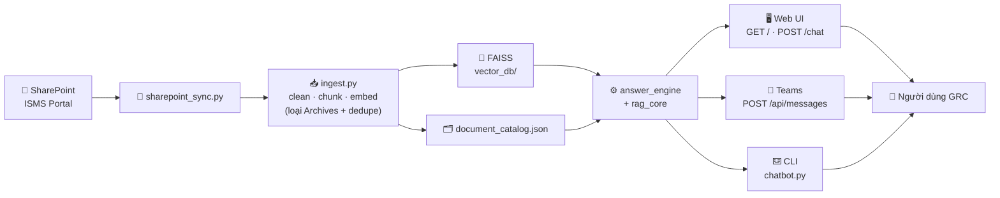
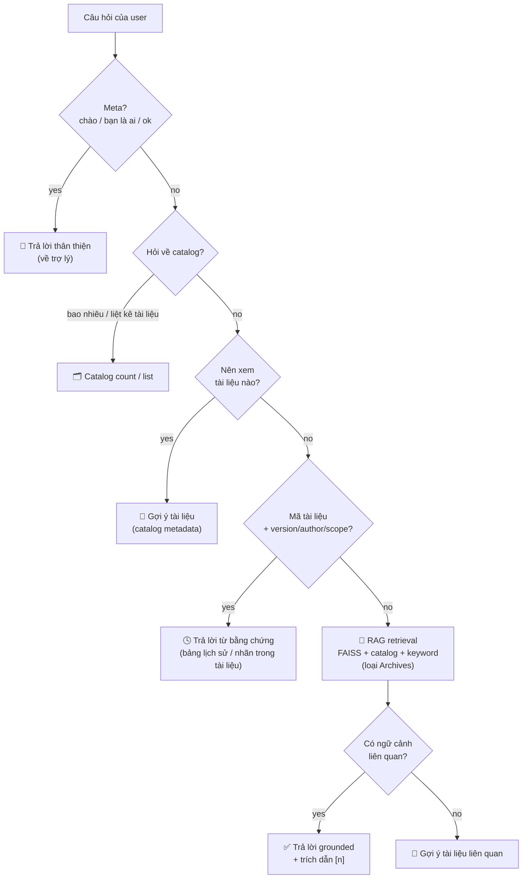

<div align="center">

# 🛡️ GRC Assistant

### Trợ lý tri thức ISMS cho ZaloPay — Compliance / GRC

Hỏi đáp **grounded** trên tài liệu bảo mật, chính sách, quy trình & tiêu chuẩn nội bộ.
Câu trả lời **chỉ lấy từ tài liệu đã được lập chỉ mục** — kèm trích dẫn nguồn `[n]`, không bịa.


</div>

---

## ✨ GRC Assistant là gì?

GRC Assistant biến bộ tài liệu **ISMS** đã được duyệt của ZaloPay thành một trợ lý hỏi đáp có thể truy cập qua **Web**, **Microsoft Teams** và **CLI**. Mọi câu trả lời đều **trích dẫn trực tiếp từ tài liệu** đã lập chỉ mục — phù hợp cho môi trường tuân thủ, nơi câu trả lời sai/bịa là không chấp nhận được.

> **Triết lý:** tài liệu nằm ở nguồn đã duyệt → index dựng sẵn trước khi chạy → câu trả lời luôn dẫn nguồn → dịch vụ hosted không sync/ingest lúc khởi động.

## 🌟 Điểm nổi bật

| | Tính năng |
|---|---|
| 🎯 | **Định tuyến thông minh** — tự nhận diện câu hỏi: chào hỏi · "có bao nhiêu tài liệu" · "nên xem tài liệu nào về X" · "tài liệu Y có mấy phiên bản" · hỏi nội dung (RAG) |
| 📎 | **Trích dẫn kiểu NotebookLM** — chèn `[n]` inline; trên web hover để xem nguồn, click để cuộn tới & highlight thẻ nguồn tương ứng |
| 🧭 | **Gợi ý tài liệu** — hỏi "tham khảo tài liệu gì về …" → đề xuất đúng tài liệu từ catalog metadata (không phụ thuộc embedding yếu) |
| 🕓 | **Lịch sử phiên bản** — "ZION-QT-04 có mấy version" → liệt kê đúng từ bảng lịch sử trong tài liệu, dẫn đúng nguồn |
| 🧹 | **Lọc nhiễu** — tự loại tài liệu `Archives/` cũ & bản trùng khỏi retrieval, chỉ giữ bộ ISMS Portal hiện hành |
| 🛟 | **Fallback có ích** — không tìm thấy → gợi ý tài liệu liên quan thay vì "Không tìm thấy" cụt lủn |
| 🎨 | **Web UI ZaloPay** — trang intro tổng quan + chat, light/dark mode, render markdown |
| 💬 | **Teams bot** — trả lời **proactive** (ACK ngay + gửi đáp án sau) nên không bị drop khi LLM chậm |

## 🏗️ Kiến trúc



## 🔀 Một câu hỏi được trả lời thế nào



## 📚 Cơ sở tri thức

Bộ **ISMS Portal** hiện hành — **52 tài liệu duy nhất**:

| Loại | Số lượng |
|---|---:|
| 📏 Tiêu chuẩn (Standard) | 25 |
| 🔧 Quy trình (Procedure) | 13 |
| 🗃️ Hồ sơ (Record) | 8 |
| 📜 Chính sách (Policy) | 4 |
| 🏅 Chứng nhận (Certificate) | 2 |
| **Tổng** | **52** |

> Index loại bỏ thư mục `Archives/` (các bản 2022–2023 lỗi thời) và các bản sao trùng để retrieval không bị nhiễu.

## 🖥️ Giao diện & API

| Endpoint | Mô tả |
|---|---|
| `GET /` | Web UI (trang intro + chat, light/dark, citations) |
| `POST /chat` | API hỏi đáp JSON — trả `answer`, `sources`/`citations`, `answer_type` |
| `GET /documents` · `GET /documents/count` | Danh sách & thống kê tài liệu (kèm phân loại) |
| `POST /api/messages` | Microsoft Teams (Bot Framework) |
| `GET /health` | Health check cho runtime |
| `chatbot.py` | CLI hỏi đáp tại máy |

## ⚙️ Tech stack

- **Ngôn ngữ/Server:** Python 3.10 · `aiohttp`
- **RAG:** LangChain · **FAISS** (`faiss-cpu`) · `sentence-transformers` (`paraphrase-multilingual-MiniLM-L12-v2`)
- **LLM:** OpenAI-compatible (GreenNode AI Platform / VNG MaaS — Qwen)
- **Teams:** `botbuilder-core` / `botbuilder-schema`
- **Hạ tầng:** Docker → **GreenNode AgentBase** runtime · `msal` (SharePoint Graph) · `pypdf`

## 🚀 Chạy tại máy

<details>
<summary><b>Các bước (bấm để mở)</b></summary>

```bash
# 1. Cài dependencies
python -m pip install -c constraints.txt -r requirements.txt

# 2. Tạo .env từ mẫu (điền API key + cấu hình)
cp .env.example .env

# 3. Dựng index từ tài liệu (papers/ hoặc sharepoint_downloads/)
python ingest.py
python build_document_catalog.py      # đồng bộ catalog với index

# 4a. Hỏi đáp qua CLI
python chatbot.py

# 4b. Hoặc chạy web + API + Teams endpoint
python teams_bot.py                    # → http://localhost:3978
```

Biến môi trường chính (xem `.env.example`): `AI_PLATFORM_API_KEY`, `AI_PLATFORM_BASE_URL`, `AI_PLATFORM_MODEL`, `EMBEDDING_MODEL`, `MAX_TOKENS`, `RETRIEVAL_K`, `MICROSOFT_APP_ID/PASSWORD/TENANT_ID`, `SHAREPOINT_*`.

</details>

## 🔄 Cập nhật tri thức

```bash
python sharepoint_sync.py        # tải tài liệu mới nhất từ ISMS Portal
python ingest.py                 # dựng lại FAISS (tự loại Archives + dedupe)
python build_document_catalog.py # đồng bộ catalog
python predeploy_check.py        # kiểm tra sẵn sàng trước khi deploy
```

## ☁️ Triển khai (GreenNode AgentBase)

Container chạy `python teams_bot.py`, lắng nghe cổng **8080**, bundle sẵn `vector_db/` + `document_catalog.json`.

```bash
python predeploy_check.py                                   # phải PASS
docker build --platform linux/amd64 -t grc-assistant .      # image deploy
# Đẩy lên runtime qua AgentBase (skill /agentbase-deploy)
```

Chi tiết: [DEPLOYMENT.md](DEPLOYMENT.md) · Teams: [README_TEAMS.md](README_TEAMS.md)

## 🗂️ Cấu trúc chính

```text
answer_engine.py          # Điều phối: meta · catalog · discovery · metadata · RAG
rag_core.py               # Retrieval + sinh câu trả lời + trích dẫn [n]
conversational.py         # Câu chào / meta / filler
document_recommendation.py# Gợi ý "nên xem tài liệu nào" + fallback
catalog_metadata.py       # Định tuyến câu hỏi metadata (version/author/scope…)
document_evidence_metadata.py # Trả lời metadata từ bằng chứng trong tài liệu
catalog_service.py        # Catalog count/list + phân loại tài liệu
document_code_utils.py    # Nhận diện & chuẩn hoá mã tài liệu (ZION-QT-04…)
ingest.py                 # PDF → clean → chunk → embed → FAISS (loại Archives)
sharepoint_sync.py        # Đồng bộ tài liệu từ SharePoint ISMS Portal
teams_bot.py              # aiohttp server: web UI + /chat + Teams /api/messages
static/                   # Web UI (index.html · app.js · styles.css)
teams_app/                # Gói Microsoft Teams (manifest + icons)
```

## 🔐 Bảo mật

- **Không** commit secret (`.env`, `.greennode.json`, token, credentials) — đã chặn qua `.gitignore`/`.dockerignore`.
- SharePoint sync **giới hạn** đúng folder ISMS Portal.
- Câu trả lời **grounded** — không bổ sung kiến thức ngoài tài liệu.

Xem thêm: [SECURITY.md](SECURITY.md)

## 📄 Tài liệu

[Teams setup](README_TEAMS.md) · [Deployment](DEPLOYMENT.md) · [API contract](API_CONTRACT.md) · [Chunking](CHUNKING_STRATEGY.md) · [Smart RAG](SMART_RAG.md) · [Frontend](README_FRONTEND.md)

<div align="center">
<sub>Built for ZaloPay Compliance · GRC — grounded, cited, internal.</sub>
</div>
